# Comparación de YOLOv8n y FOMO para la detección de objetos de riesgo en pasillos escolares

**Creado por:** Diego Raul Hernandez Cardeña

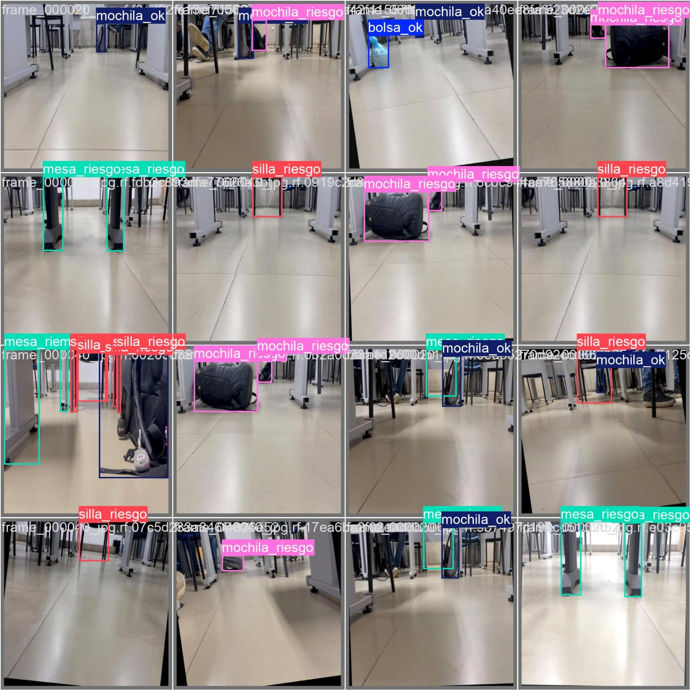

**Modelos:** YOLOv8n (laptop) · FOMO MobileNetV2 0.35 (ESP32)

## Descripción

En entornos educativos es frecuente observar objetos abandonados
en pasillos que representan un riesgo durante emergencias es por eso que se desarrollo el entrenamiento para la identificacion de estos objetos que puedan hacer que uno corra riesgo de salir perjudicado en caso de algun desastre o accidente.

Primordialmente se hara una comparacion entre 2 modelos para la deteccion de los objetos en riesgos, donde YOLOv8 se usara para una mejor precision por su modelo diseñado para la identificacion de imagenes, por otra parte se usara FOMO que es para dispositivos con menos recursos de consumo ya que este puede aplicarse a una ESP32 a diferencia del modelo de YOLOv8 que tiene mayor peso en su entrenamiento

Posteriormente se hara una comparacion de precision en estos 2 modelos creados esto haciendo pruebas fisicas donde se usara un script para poder hacer la captura de las imagenes y sean procesadas por el modelo de YOLOv8 haciendo uso del MechDog como capturador de datos con un Celular que comparta video mediante IP para hacer la captura de video

Y tambien ser hara la comparacion con una ESP32 con camara para la captura del mismo donde se usara la interfaz de Arduino para ver en tiempo como se captura y ver la precision de este

Este proyecto tiene como fin no solamente que sea aplicado a un ambiente escolar sino que esta visto para deteccion de objetos en lugares donde se debe priorizar un pasillo libre de obstaculos como lo pueden ser oficinas o bodegas en donde es escencial el tener lugar amplio para poder realizar sus actividades correspondientes

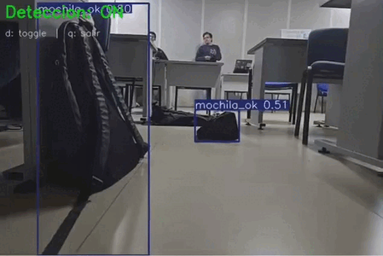

## PASO 1: Configuracion del entorno de desarrollo

Para el desarrollo de este proyecto se utilizaron las siguientes herramientas y plataformas:

| Herramienta | Uso | Costo |
| --- | --- | --- |
| Google Colab | Entrenamiento YOLOv8 con GPU T4 | Gratuito |
| Roboflow | Etiquetado y gestión del dataset | Gratuito |
| Edge Impulse | Entrenamiento modelo FOMO | Gratuito |
| Google Drive | Almacenamiento del proyecto | Gratuito |
| Python 3.12 | Lenguaje de programación | Gratuito |
| Ultralytics YOLOv8 | Framework de detección | Gratuito |

### Estructura del proyecto en Google Drive

### Instalación de dependencias en Google Colab

#### Primero hacer una nueva libreta y posteriormente ejecutar el siguiente codigo

```python
!pip install ultralytics -q
```

Para verificar que la GPU está activa:

```python
import torch
print("GPU disponible:", torch.cuda.is_available())
print("GPU:", torch.cuda.get_device_name(0))
```

## PASO 2: Grabacion del dataset haciendo uso del MechDog

### Hardware utilizado

- **Robot:** MechDog de Hiwonder
- **Cámara:** iPhone 12 montado sobre el MechDog
- **Resolución:** 1080p a 30fps
- **Orientación:** horizontal, inclinación ~15° hacia abajo aproximadamente

### Configuración de grabación en iPhone 12

Antes de iniciar cada video se bloqueó la exposición manteniendo  presionado el centro del pasillo en la pantalla, evitando  fluctuaciones de luz durante el recorrido del robot.

### Espacio grabado

El salón de clases tiene la siguiente distribución:

#### agregar imagen de distribucion del salon

Se grabaron **2 pasillos verticales** (P1 y P2) de
aproximadamente 5 metros cada uno.

### Protocolo de grabación por video

Para cada video el robot siguió este recorrido:

1. Inicio en la pared frontal o trasera
2. Avance a velocidad normal por el pasillo
3. Continuación hasta la pared opuesta
4. Repetir de pared trasera a frontal

### Videos grabados — 36 en total

| Video | Objeto | Pasillo | Duración |
| --- | --- | --- | --- |
| VID01 | 2 mochilas mal puestas | P1 | 44.6s |
| VID02 | 2 mochilas mal puestas | P1 | 43.0s |
| VID03 | 2 mochilas bien puestas | P1 | 41.4s |
| VID04 | 2 mochilas bien puestas | P1 | 42.9s |
| VID05 | Cables bien organizados | P1 | 54.0s |
| VID06 | Cables bien organizados | P1 | 43.3s |
| VID07 | Mesa obstruyendo pasillo | P1 | 45.6s |
| VID08 | Mesa obstruyendo pasillo | P1 | 41.0s |
| VID09 | Silla obstruyendo pasillo | P1 | 39.0s |
| VID10 | Silla obstruyendo pasillo | P1 | 40.3s |
| VID11 | 1 mochila + 1 bolsa bien | P1 | 41.0s |
| VID12 | 1 mochila + 1 bolsa bien | P1 | 47.0s |
| VID13 | 1 mochila bien puesta | P1 | 40.6s |
| VID14 | 1 mochila bien puesta | P1 | 51.2s |
| VID15 | 1 mochila mal puesta | P1 | 53.9s |
| VID16 | 1 mochila mal puesta | P1 | 65.5s |
| VID17 | Pasillo libre | P1 | 39.1s |
| VID18 | Pasillo libre | P1 | 39.3s |
| VID19–VID36 | Escenarios P2 y combinados | P2 | ~35–51s |

**Duración total grabada:** 1,508s (25.1 minutos) esto puede variar ya que a la hora del etiquetado y separacion de frames salen muchos que no son utiles, asi que tener en cuenta eso y hacer que tenga frames que sean de utilidad

## PASO 3: Extracción de frames en Google Colab

De los 36 videos se extrajeron fotogramas automáticamente
con un script Python ejecutado en Google Colab pero que estara en la carpeta de notebooks

### Lógica de extracción

A 30fps, extraer 1 frame cada 20 equivale a obtener
1.5 imágenes por segundo. Para videos de 35–65 segundos
esto produce entre 52 y 98 imágenes por video.

36 videos × ~62 imgs promedio = ~2,241 imágenes extraídas

`separacion_frames.ipynb`

## PASO 4: Etiquetado en RoboFlow

Las imágenes seleccionadas se subieron a
[Roboflow](https://roboflow.com) para su etiquetado manual
con bounding boxes.

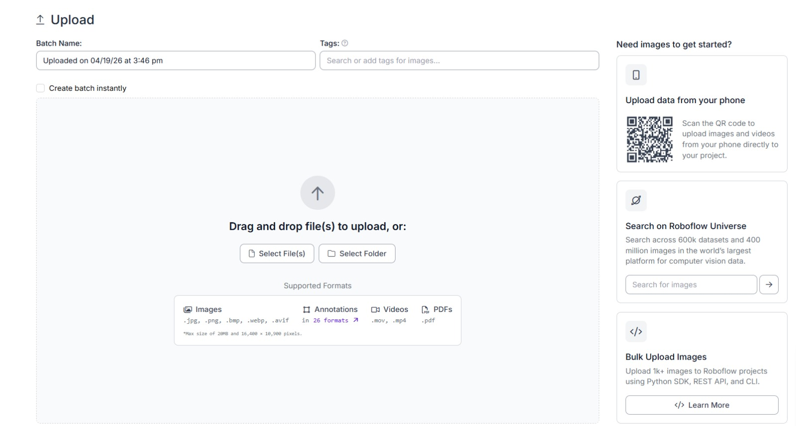
Aqui se hace insercion de sus frames extraidos anteriormente para poder empezar con el etiquetado en robofow

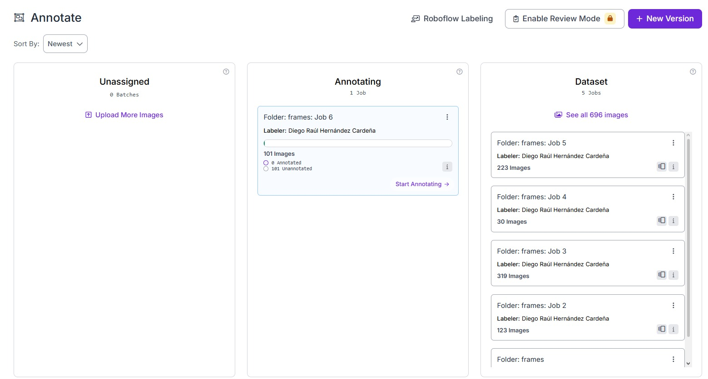
En esta parte del menu puedes visualizar cuantas anotaciones llevas o te faltan, cabe recalcar que aqui se puede trabajar en colaborativo por lo que es muy util por esa parte el adminstrar que parte le tocara a cada quien

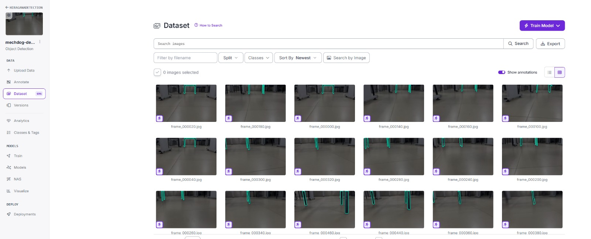
En esta parte final es como visualizas el dataset ya terminado con sus anotaciones para posteriormente poder importarlo para su uso

### Clases definidas

| Clase | Descripción | ¿Activa alerta? |
| --- | --- | --- |
| `mochila_riesgo` | Mochila tirada en medio del pasillo | ✅ Sí |
| `mochila_ok` | Mochila bajo escritorio o contra la pared | ❌ No |
| `silla_riesgo` | Silla desplazada al pasillo | ✅ Sí |
| `mesa_riesgo` | Mesa obstruyendo el paso | ✅ Sí |
| `cables_ok` | Cables organizados, no obstruyen | ❌ No |
| `caja_ok` | Caja bien ubicada | ❌ No |
| `bolsa_ok` | Bolsa bien ubicada | ❌ No |

### Reglas de etiquetado

- El bounding box va ajustado al borde exacto del objeto
- Si hay 2 objetos visibles en el mismo frame, se etiquetan ambos
- Los frames de pasillo libre (VID17–VID20) se subieron sin etiquetar — sirven como ejemplos negativos

### Dataset final generado

- **Imágenes originales etiquetadas:** 696
- **Split:** 70% train / 15% valid / 15% test (generado en Colab)
- **Augmentations aplicadas:** flip horizontal, brillo ±20%, rotación ±10°, blur hasta 1px
- **Total con augmentations:** ~2,088 imágenes para entrenamiento

### Distribución por clase

| Clase | Frames | % del total |
| --- | --- | --- |
| mochila_ok | 1,235 | 40.8% |
| mochila_riesgo | 685 | 22.6% |
| cables_ok | 373 | 12.3% |
| silla_riesgo | 356 | 11.8% |
| bolsa_ok | 133 | 4.4% |
| mesa_riesgo | 131 | 4.3% |
| caja_ok | 112 | 3.7% |

## PASO 5: Entrenamiento YOLOv8 en Google Colab

### ¿Por qué YOLOv8n?

Se eligió YOLOv8n (variante nano) porque ofrece el mejor equilibrio entre velocidad y precisión para hardware limitado. Con 3.2M de parámetros alcanza ~15–20 FPS en CPU y más de 30 FPS con GPU, lo que lo hace viable para detección en
tiempo real.

### Configuracion del entrenamiento

la configuracion del entrenamiento esta en formato de notebook titulado `entrenamiento.ipynb` en la carpeta de notebook_colab

## PASO 6: Resultados y métricas en YOLOv8

| Métrica | Valor |
| --- | --- |
| Precision | 0.962 |
| Recall | 0.963 |
| mAP@0.5 | 0.972 |
| mAP@0.5:0.95 | 0.902 |

### Métricas por clase

| Clase | Precision | Recall | AP@0.5 |
| --- | --- | --- | --- |
| mochila_riesgo | 1.000 | 1.000 | 0.995 |
| mochila_ok | 1.000 | 0.991 | 0.995 |
| bolsa_ok | 1.000 | 1.000 | 0.995 |
| caja_ok | 1.000 | 1.000 | 0.995 |
| mesa_riesgo | 1.000 | 0.986 | 0.985 |
| cables_ok | 1.000 | 0.944 | 0.945 |
| silla_riesgo | 0.956 | 0.891 | 0.894 |

### Comparación contra modelo COCO base

El modelo base YOLOv8n sin fine-tuning fue evaluado sobre
las mismas 20 imágenes de prueba. Solo detectó objetos en
7 de las 20 imágenes (35%), produciendo clasificaciones
incorrectas como `surfboard` y `vase` para objetos propios
del entorno escolar. Adicionalmente, COCO no puede distinguir
entre `mochila_riesgo` y `mochila_ok` ya que ambas
corresponden a la misma clase genérica `backpack`.

| Criterio | COCO base | YOLOv8n fine-tuned |
| --- | --- | --- |
| Imágenes detectadas | 7/20 (35%) | 313/313 (100%) |
| Clases relevantes | Genéricas | Contextuales |
| Distingue riesgo/ok | ❌ | ✅ |
| Falsos positivos | surfboard, vase | Ninguno |
| mAP@0.5 | N/A | **0.972** |

### Matriz de confusion del modelo YOLOv8

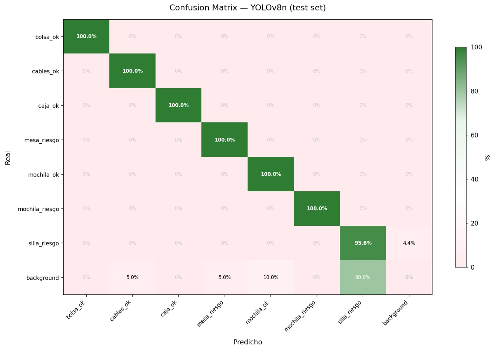

## PASO 7: Entrenamiento FOMO en Edge Impulse

Para hacer el sistema viable en hardware de bajo costo
(ESP32-CAM, ~$8 USD) se entrenó un segundo modelo usando
FOMO (Faster Objects, More Objects) en Edge Impulse.

### ¿Por qué FOMO?

Se escogio tambien para hacer una comparacion ya que en muchos casos varias instituciones no cuentan con mejor hardware entonces y demostrando que tambien se puede aplicar a pesar que no tenga tantos recursos este tipo de modelos a ese contexto

| Característica | YOLOv8n | FOMO |
| --- | --- | --- |
| RAM necesaria | ~200 MB | ~62 KB |
| Peso del modelo | ~6 MB | ~245 KB |
| Hardware mínimo | Laptop/GPU | ESP32 solo |
| Resolución entrada | 640×640 | 96×96 |

### Preparación del dataset para Edge Impulse

Para la preparacion del dataset podemos trabajar con el mismo que se creo en la plataforma de Edge Impulse aqui los pasos para el entrenamiento

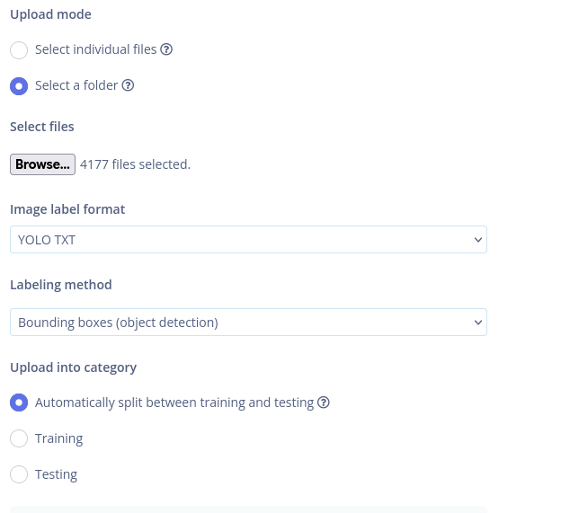
Al crear un proyecto y darle clic en importar data aparece esta ventana y debes importar tu carpeta de dataset creado con roboflow

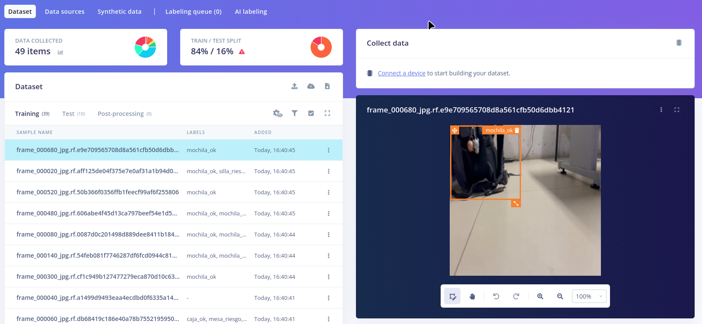
Asi es como se ve una vez subido el dataset de roboflow adaptado para trabajar en Edge Impulse, cabe recalcar que tambien incluye su etiquetamiento

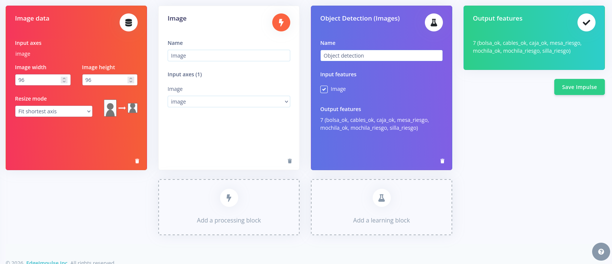
Despues en la creacion del modelo se va uno a al menu de la izquierda y donde es impulse design en create impulse se ponen estos parametros.

Input block   →  Image 96×96 Grayscale

Processing    →  Image (normalización)

Learning      →  Object Detection (FOMO)

→  FOMO MobileNetV2 0.35

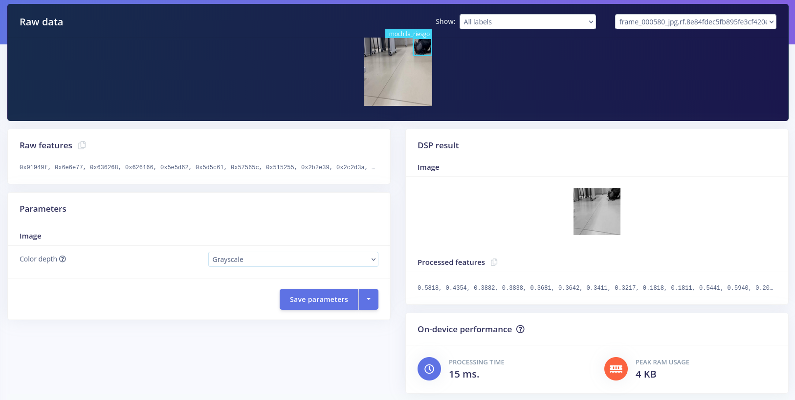
En el menu de la izquiera de nuevo en la seccion de Image se vera asi y deberas poner estos valores y guadarlos


Por ultimo en la seccion siguiente seleccionar Object detection para posteriormente ingresar estos valores de la imagen para despues entrenar y guardar el modelo, **OJO**, en la seccion de Profile int8 model tienes que dejarla sin confirmar

| Parámetro | Valor |
| --- | --- |
| Épocas | 60 |
| Learning rate | 0.001 |
| Batch size | 32 |
| Resolución | 96×96 px |
| Color depth | Grayscale |

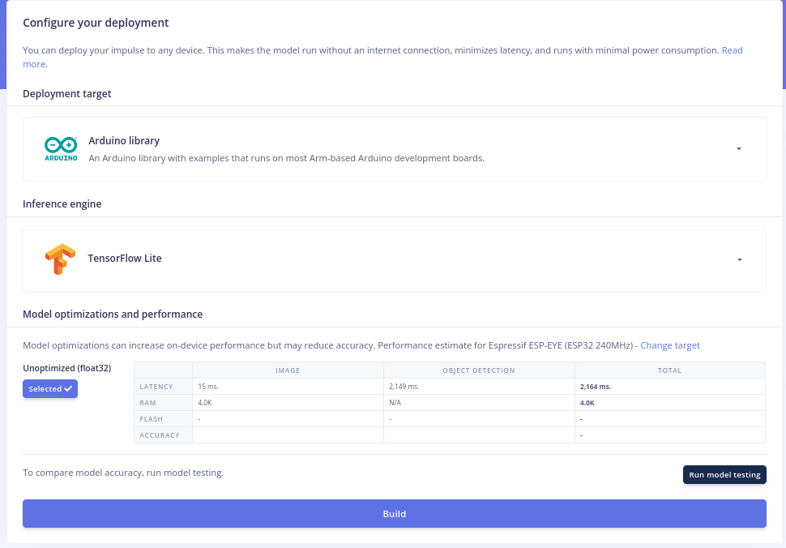
Para obtener el modelo en este caso pusimos la opcion de arduino y en inference engine como TensorFlow lite luego darle build para obtener el entrenamiento como libreria de arduino.

### Hiperparámetros de entrenamiento FOMO

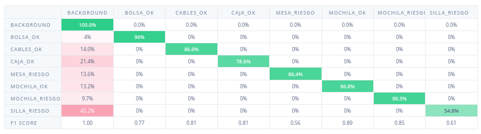

## PASO 8: Resultados FOMO y comparación de modelos

### Métricas FOMO (validation set)

**F1 Score global (non-background): 75.5%** · Precisión: 72.5% · Recall: 78.7%

| Clase | Precisión | Recall | F1 Score | Soporte |
| --- | --- | --- | --- | --- |
| bolsa_ok | 0.649 | 0.960 | 0.774 | 25 |
| cables_ok | 0.771 | 0.860 | 0.813 | 43 |
| caja_ok | 0.846 | 0.786 | 0.815 | 14 |
| mesa_riesgo | 0.410 | 0.864 | 0.556 | 66 |
| mochila_ok | 0.907 | 0.868 | 0.887 | 235 |
| mochila_riesgo | 0.808 | 0.903 | 0.853 | 93 |
| silla_riesgo | 0.678 | 0.548 | 0.606 | 177 |

### Tabla comparativa final

| Clase | YOLOv8 AP50 | FOMO F1 |
| --- | --- | --- |
| mochila_riesgo | 0.995 | 0.853 |
| mochila_ok | 0.995 | 0.887 |
| bolsa_ok | 0.995 | 0.774 |
| caja_ok | 0.995 | 0.815 |
| mesa_riesgo | 0.985 | 0.556 |
| cables_ok | 0.945 | 0.813 |
| silla_riesgo | 0.894 | 0.606 |
| **Promedio** | **0.972** | **0.755** |

La diferencia de 21.7 puntos porcentuales en precisión
entre YOLOv8n y FOMO representa la compensación necesaria
para reducir el costo de hardware en un 98%

## PASO 9: Deteccion en tiempo real con YOLOv8n

Para este paso se realizo un script usando python en las cuales se usaron las siguientes librerias:

- ultralytics>=8.0.0
- opencv-python>=4.8.0
- requests>=2.31.0
- torch>=2.0.0

El script esta en la carpeta scripts y primero se hace la prueba con el modelo yolo el otro es para su implementacion con una ESP32 y esta en la carpeta de modelos.

Para visualizar el programa de deteccion con el modelo yolo se visualiza con el programa de **detector.py** que se ejecuta asi (ten en cuenta que la ip varia con la aplicacion de ip camera de tu telefono):

```python
 python detector.py --ip 210.139.240.31 --port 8080 --stream video
```

## PASO 10: Deteccion en tiempo real con la ESP32

Para la configuracion de este se realiza primero el reseteo de la  esp32 para evitar que tenga choques con firmware que haya existido, en este caso al usar el mechdog de hiwonder cuenta con su propio firmware, para eso guardamos una copia de seguridad de este y despues procedemos a hacer el borrado de la ESP32-SE con modulo de camara

para este caso usamos estos comandos en linux:

#### Instalacion para hacer el backup

``` bash
sudo pacman -S python-pip

pip install esptool
```

#### Identificar el puerto de tu esp32

``` bash
ls /dev/tty*
```

#### Leer todo el firmware para hacer el backup

``` bash
esptool.py --chip esp32s3 --port /dev/ttyUSB0 read_flash 0x0 0x800000 backup_hiwonder.bin
```

*TENER EN CUENTA* que si tu placa tiene mas de 8mb puedes cambiar el valor a '0x1000000' o tambien para verificar que se hizo revisar el tamaño del archivo backup con el siguiente comando 'esptool.py flash_id'

## Firmware para volver al que se tenia

``` bash
esptool.py --chip esp32s3 --port /dev/ttyUSB0 write_flash 0x0 backup_hiwonder.bin
```

## Borrar firmware para flashear en arduino IDE

``` bash
esptool.py --chip esp32s3 --port /dev/ttyUSB0 erase_flash
```

## Configuracion de Arduino IDE

Para esta parte haremos la configuracion de esta interfaz para trabajar con la ESP32-S

### paso 1: Importacion de libreria

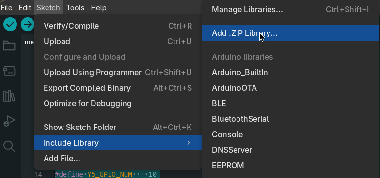
Despues de esto agregas la libreria en .zip que se descargo de Edge Impulse

### paso 2: Configuracion de herramientas en la IDE

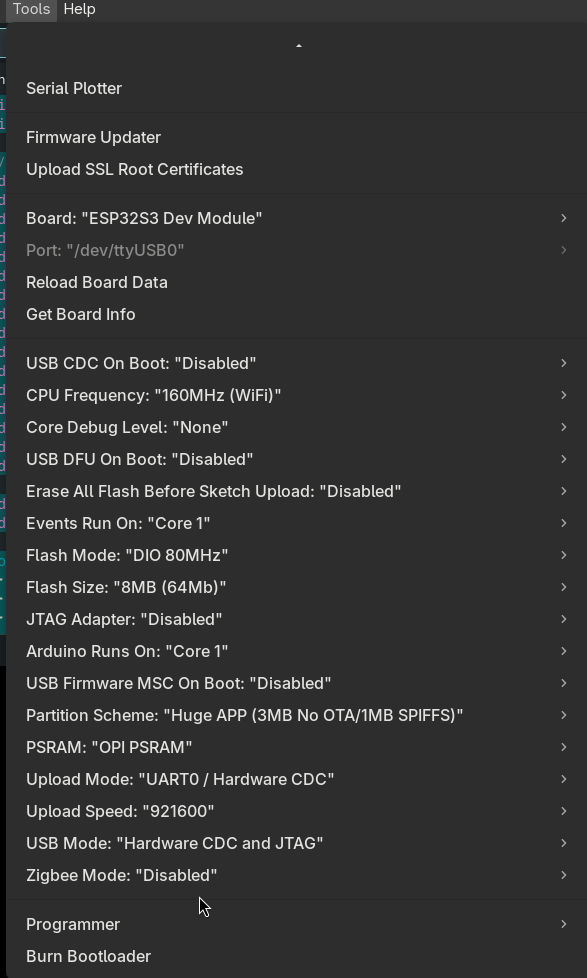
Despues hacer esta configuracion para la placa ESP32S para que pueda hacer la compilacion

### paso 3: Implementacion de codigo y compilacion

Despues de tener la configuracion se implemento el codigo que esta en la carpeta de 'scritps' como .ino y tambien el receptor_fomo.py esto debido a que el archivo .ino muestra los resultados en terminal, por lo que se implemento en python un script que hace uso de la red para poder capturar los datos en teminal desde el mechDog

## Conclusiones

En conclusion, la implementacion de estos modelos para ver en tiempo real es algo muy interesante ya que podemos hacer su comparacion de precision, por un lado el uso de un equipo especifico es obviamente de mejor calidad pero en cuanto a la parte economica muchos lugares como instituciones publicas no aceptan este tipo de gastos en cambio la implementacion con FOMO hace que reduzca demasiado los costos pero a cambio de precision pero al no ser tan baja precision resulta bastante optimo, e incluso puede hacer que se tenga mas precision si se hace el dataset especificamente para el modelo, por ende es mas rentable la implementacion de este modelo con una baja infraestructura para la deteccion de objetos.
